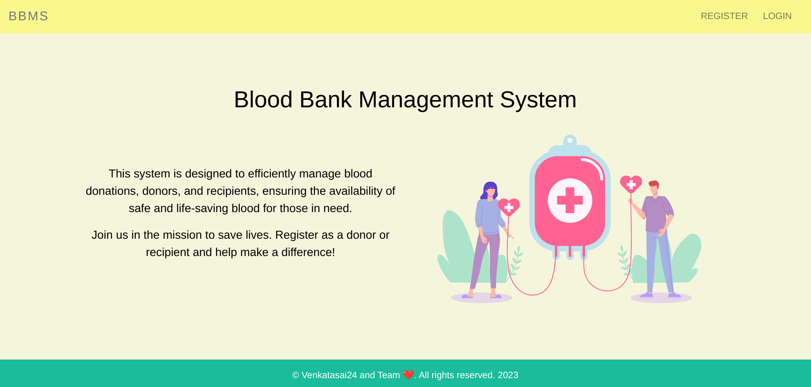

# BBMS



Blood Bank Management System (BBMS) is a web-based application designed to efficiently manage blood donations, donors, and recipients. It provides an integrated platform for donors and recipients to ensure the availability of safe and life-saving blood for those in need.

## Table Of Contents

- [Prerequisites](#prerequisites)
- [Deployment](#deployment)
- [Installation](#installation)
- [Usage](#usage)
- [Features](#features)
- [Technologies Used](#technologies-used)
- [Contributing](#contributing)
- [License](#license)

## Prerequisites

Before you begin, ensure you have met the following requirements:

- **XAMPP**: You need XAMPP installed for hosting the application in your Linux environment.XAMPP includes Apache, MySQL, PHP, and phpMyAdmin, which are essential for running the application.

For a detailed guide on how to install XAMPP on linux, you can watch this [video](https://www.youtube.com/watch?v=XoKUkdmfTZQ).

## Deployment

For a detailed guide on how to deploy a PHP and MYSQL application on internet, you can watch this [video](https://youtu.be/IbUmbYKY_Q4?si=1Od8XSaNmLZ8CRiY).


## Installation

To set up the BBMS application with XAMPP in your Linux environment, follow these steps:

1. Clone the repository into your local machine in the directory where your PHP web server is serving files. In my case, it's located in `/opt/lampp/htdocs`.

   ```bash
   git clone https://github.com/venkatasai24/BBMS.git
   ```

2. Go to the phpMyAdmin in your web browser at
   ```bash
   http://localhost/phpmyadmin/
   ```
3. Create a database named `BBMS` and import the file `bbms.sql` present in `/opt/lampp/htdocs/BBMS/database`.

4. Access the application in your web browser at
   ```bash
   http://localhost/BBMS/index.php
   ```

## Usage

- **Login**: Users can log in with their respective roles (patient, donor, or admin) using their credentials.
- **Patients**: Patients have access to their profiles, blood donation requests, and request history.
- **Donors**: Donors can view their profile , blood donations, and check their donation history.
- **Admin**: Admins have access to user and donation management features.

## Features

- User authentication and role-based authorization for patients, donors, and admins.
- Profile management for patients and donors.
- Blood donation request system.
- Donation history tracking.
- Admin panel for user and donation management.

## Technologies Used

- **PHP**: Backend scripting language.
- **MySQL**: Database management system.
- **Bootstrap**: Front-end framework for styling.
- **Apache**: Web server.

## Contributing

Contributions are always welcome! If you'd like to contribute to the project, please follow these steps:

1. Fork the repository.
2. Create a new branch for your feature or fix:
   ```bash
   git checkout -b feature/your-feature
   ```
3. Commit your changes and push to your fork:
   ```bash
   git commit -m 'Add some feature'
   git push origin feature/your-feature
   ```
4. Create a pull request on the original repository's `main` branch.

## License

This project is licensed under the [MIT License](https://github.com/venkatasai24/BBMS/blob/main/LICENSE).


